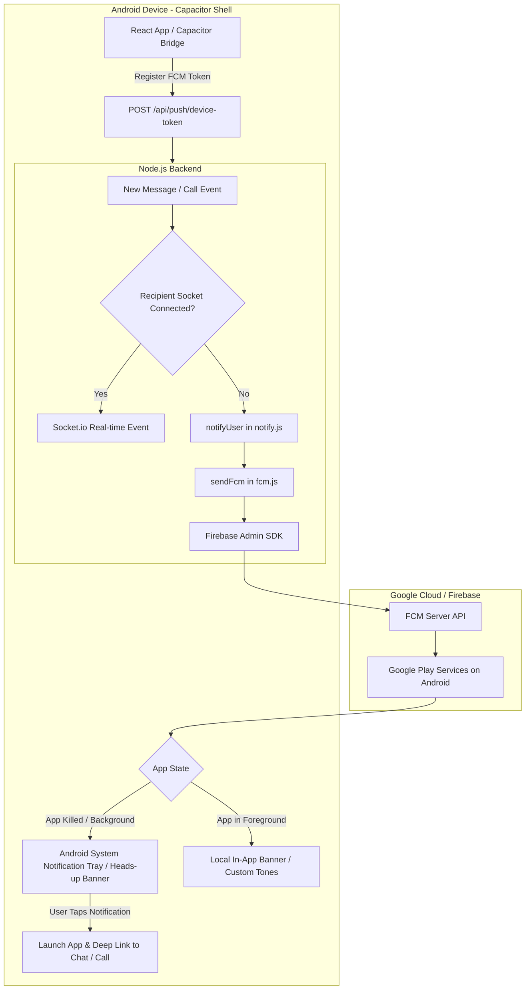

# Android App & Active Push Notifications Implementation Plan

## 1. Objective & Background

### The Problem
In mobile web browsers and Progressive Web Apps (PWAs):
- Background Service Workers are aggressively terminated or put into deep sleep by Android OS battery optimization (Doze mode) and manufacturer ROMs (Samsung OneUI, Xiaomi MIUI/HyperOS, OnePlus OxygenOS).
- Web Push cannot reliably display persistent heads-up banners, wake up the device screen, or trigger ongoing call ringtones when the browser is swiped away or closed.

### The Solution: Native Android App with Capacitor + Firebase Cloud Messaging (FCM)
By wrapping the existing React 19 + Vite frontend in a native **Capacitor** Android shell:
1. **100% Code Reuse:** Keep the entire existing Cyber Dark UI, WebRTC calls, E2EE encryption, audio waveforms, and Socket.io architecture.
2. **WhatsApp-Grade Background Delivery:** When the app is closed or backgrounded, Google Play Services keeps an OS-level connection open. Incoming messages and calls arrive via FCM high-priority payloads, triggering immediate heads-up notifications with sound and vibration.
3. **Direct Deep Linking:** Tapping a notification opens the app directly into the relevant 1-on-1 chat, group, or incoming call screen.
4. **Hardware Integrations:** Seamless Android hardware back button gesture handling, full camera/mic permissions for WebRTC calls, and native status bar styling.

---

## 2. System Architecture



---

## 3. Detailed Step-by-Step Implementation Roadmap

### Phase 1: Firebase Project & Credentials Setup
*FCM is required to send notifications through Google Play Services to Android devices.*

1. **Create/Configure Firebase Project:**
   - In [Firebase Console](https://console.firebase.google.com), create a project named `Pulse-Chat` (or use an existing one).
   - Add an **Android Application**:
     - Android package name: `com.pulse.chat` (or `com.navodita.pulse`).
     - Register app and download the configuration file: `google-services.json`.
2. **Backend Service Account Key:**
   - In Firebase Console > *Project Settings* > *Service Accounts*, generate a new private key (`firebase-service-account.json`).
   - Store or configure `FIREBASE_SERVICE_ACCOUNT` in `server/.env`.
   - The server's `server/src/lib/fcm.js` is already coded to read this variable and initialize `firebase-admin`!

---

### Phase 2: Capacitor Project Setup in Client
*Transform the React + Vite frontend into a native Android project.*

1. **Install Capacitor Dependencies:**
   ```bash
   cd client
   npm install @capacitor/core @capacitor/cli @capacitor/android
   npm install @capacitor/push-notifications @capacitor/app @capacitor/status-bar @capacitor/splash-screen @capacitor/haptics
   ```
2. **Initialize Capacitor Configuration (`capacitor.config.json`):**
   - App ID: `com.pulse.chat`
   - App Name: `Pulse Chat`
   - Web directory: `dist`
   - Android scheme: `https`
   - Configure push notification icons and notification channel defaults.
3. **Generate Android Native Project:**
   ```bash
   npm run build
   npx cap add android
   ```
   This creates the `client/android/` Gradle project with native Java/Kotlin files.
4. **Place `google-services.json`:**
   - Copy `google-services.json` to `client/android/app/google-services.json`.
   - Ensure the Google Services Gradle plugin is included in `build.gradle` and `app/build.gradle`.

---

### Phase 3: Android Native Permissions & Notification Channels
*Configure `AndroidManifest.xml` and Android 13+ notification permissions.*

1. **Configure Permissions in `client/android/app/src/main/AndroidManifest.xml`:**
   - `<uses-permission android:name="android.permission.INTERNET" />`
   - `<uses-permission android:name="android.permission.POST_NOTIFICATIONS" />` (Mandatory for Android 13+)
   - `<uses-permission android:name="android.permission.RECORD_AUDIO" />` (For voice notes and WebRTC audio)
   - `<uses-permission android:name="android.permission.CAMERA" />` (For photos and WebRTC video calls)
   - `<uses-permission android:name="android.permission.MODIFY_AUDIO_SETTINGS" />`
   - `<uses-permission android:name="android.permission.VIBRATE" />`
   - `<uses-permission android:name="android.permission.WAKE_LOCK" />`
2. **Create High-Priority Notification Channel:**
   - Android requires a Notification Channel for notifications to pop up.
   - Channel ID: `pulse_messages`
   - Importance: `High` / `Max` (produces heads-up banner and sound).
   - Sound: `default` or custom chat chime.

---

### Phase 4: Client-Side Push Bridge & Native Integration
*Wire up token registration and notification handling in React.*

1. **Implement `client/src/lib/nativePush.js`:**
   - Detect native platform with `Capacitor.isNativePlatform()`.
   - Request notification permissions:
     ```javascript
     const perm = await PushNotifications.requestPermissions();
     if (perm.receive === 'granted') {
       await PushNotifications.register();
     }
     ```
   - Listen for token event:
     ```javascript
     PushNotifications.addListener('registration', async (token) => {
       await axiosInstance.post('/push/device-token', {
         token: token.value,
         platform: 'android'
       });
     });
     ```
   - Listen for notification click / open:
     ```javascript
     PushNotifications.addListener('pushNotificationActionPerformed', (notification) => {
       const data = notification.notification.data;
       handlePushAction(data); // routes directly to ?chat=... or ?callFrom=...
     });
     ```
2. **Update `client/src/lib/push.js`:**
   - Seamlessly delegate to `nativePush.js` when running on Android, falling back to Web Push when running in desktop browsers.
3. **Android Hardware Back Button:**
   - Use `@capacitor/app` (`App.addListener('backButton', ...)`) to close open modals, preview drawers, or active chat rooms before exiting the app.

---

### Phase 5: Network Configuration & Environment Alignment
*Handle local development and production endpoints for the Android app.*

1. **Backend Connectivity for Android:**
   - During local testing on Android Emulator, `localhost` refers to the Android device itself. The host machine is reachable via `http://10.0.2.2:5000`.
   - On physical devices over Wi-Fi, the backend runs on the local IP (e.g. `http://192.168.1.X:5000`).
   - In production, it connects to your live HTTPS server (e.g., Render/Railway/VPS).
2. **Allow Cleartext Traffic (for local HTTP testing):**
   - Add `android:usesCleartextTraffic="true"` to `AndroidManifest.xml` so the app can communicate with local `http://` backend endpoints without SSL errors during development.
3. **Auth Persistence:**
   - Ensure the JWT Bearer-token fallback in `useAuthStore.js` and `axiosInstance` stores tokens in `localStorage` for WebView persistence, alongside cookies.

---

### Phase 6: Build, Run & Verification

1. **Verify Local Android Tooling:**
   - User machine has Java 25 and Android SDK at `C:\Users\rithw\AppData\Local\Android\Sdk`.
   - Configured AVDs: `Medium_Phone_API_36.1` and `Virtual_Phone`.
2. **Build and Sync:**
   ```bash
   cd client
   npm run build
   npx cap sync android
   ```
3. **Run on Android Emulator:**
   - Start the emulator:
     ```powershell
     & "C:\Users\rithw\AppData\Local\Android\Sdk\emulator\emulator.exe" -avd Medium_Phone_API_36.1
     ```
   - Build and deploy via Gradle / Capacitor CLI:
     ```bash
     npx cap run android
     ```
4. **Generate Debug APK:**
   ```powershell
   cd client\android
   .\gradlew assembleDebug
   ```
   The APK is generated at:
   `client/android/app/build/outputs/apk/debug/app-debug.apk`
   This APK can be installed on any physical Android phone via USB or shared link!

---

## 4. Verification & Testing Checklist

| Test Case | Expected Result |
|---|---|
| **Permission Request** | On first launch/login, Android prompts for notification permission. |
| **Token Registration** | FCM token is logged and stored in MongoDB `DeviceToken` collection (`platform: "android"`). |
| **Foreground Notification** | When app is open, incoming message displays in-app toast/chime. |
| **Background / Closed App** | When app is closed/swiped away, sending a message from another user triggers a native heads-up notification with sound and vibration. |
| **Notification Tap Deep Link** | Tapping the notification opens the app and navigates directly to that contact/group conversation. |
| **Voice/Video Call Alert** | Incoming call push displays notification with call type and caller name. |
| **Hardware Back Button** | Pressing back closes open menus/modals first, then exits chat to home page. |
| **APK Generation** | `app-debug.apk` builds successfully without Gradle compilation errors. |
